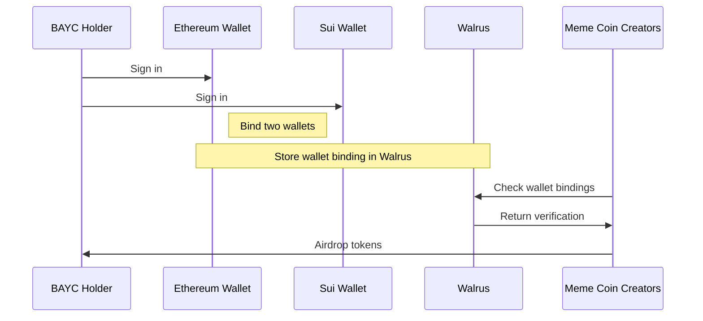

# Deep Nexus

# Intro

Deep Nexus is the first on-chain analytics platform built on Walrus, Mysten Labs' decentralized storage protocol. Unlike platforms such as Dune Analytics and Nansen that serve investors with market alpha, cash flow tracking, and protocol assessments, Deep Nexus focuses directly on Web3 projects, **providing data insights and tools to accelerate project growth.**

Our platform empowers projects with data-driven insights for:

- Cross-chain marketing tools
- User behavior analysis
- Campaign performance tracking
- And more

Built on decentralized infrastructure, Deep Nexus delivers enterprise-grade analytics to drive project growth.

# Deepsync

Deep Sync is our first and flagship service designed to help Web3 projects on Sui attract degens from other blockchains.

## Problem Statement

Let's say you've created a meme coin on the Sui blockchain called "Ape-on-Sui" and want to market it to Bored Ape Yacht Club (BAYC) NFT holders. You'd like to do an airdrop for these BAYC holders based on their NFT holdings. However, there's a challenge: since BAYC exists on Ethereum and your coin is on Sui, you can't easily connect BAYC holders' Ethereum wallets to their Sui wallet addresses.

## Current solution

[Suilink](https://www.suilink.io/) offers a solution to this cross-chain verification challenge. Here's how it works:

Users can connect multiple wallets to [Suilink](https://www.suilink.io/) simultaneously:

- Their Sui wallet
- Their Ethereum wallet
- Their Solana wallet

Once connected, [Suilink](https://www.suilink.io/) verifies ownership of all these wallets and issues a proof-of-ownership NFT. This NFT contains the verified wallet addresses across different chains. Web3 projects can then use these NFTs as a reliable way to identify users' wallet addresses across chains and distribute airdrops accordingly.

### Disadvantages

The current [Suilink](https://www.suilink.io/) solution has several significant limitations:

1. High Storage Costs
    - Recording cross-chain holdings data on-chain is expensive
    - Minting NFTs for millions of users' wallet information would incur substantial costs
    - This makes it impractical for large-scale implementations
2. Maintenance Challenges
    - Updating holdings information across chains is complicated
    - If users change their wallet addresses, updating these binding relationships becomes difficult
    - There's no efficient way to keep cross-chain wallet associations current

## Our solution: Deep Sync

Users can link their wallets together through Deep Sync to prove simultaneous ownership of multiple wallets. All this binding information is stored efficiently in Walrus, which acts as the data infrastructure for the Sui ecosystem. As the primary data layer for Sui, Walrus is ideally positioned to store these valuable cross-chain wallet associations and transaction histories.

## Demo

Here's a simple example of how a Web3 project could use Deep Sync to accelerate user growth. Let's say you're running a meme coin project and planning to launch an "Ape-on-Sui" meme coin. If you want to market to Bored Ape Yacht Club (BAYC) holders and distribute an airdrop to them based on their holdings, Deep Sync would be the perfect tool for this.

### Deepsync Flow Chart

### Wormhold Integration

We plan to integrate the Wormhole SDK into our existing SDK. Once users connect both wallets, they'll be able to seamlessly transfer their Ethereum assets to the Sui ecosystem.

## Download the SDK

 Deep Sync is currently under development and being refined. Please join our Telegram [group](https://t.me/deepnexus) to stay updated with the latest information!

# Roadmap

- Deep Sync: SDK for cross chain marketing
- Wormhole Integration with Deep Sync
- Deep Insight: A well-maintained analytics database
- More